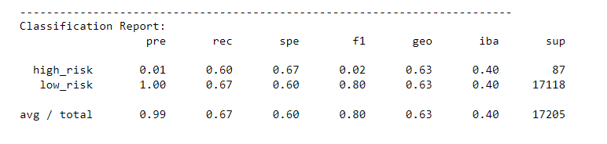
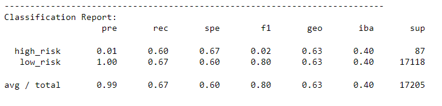
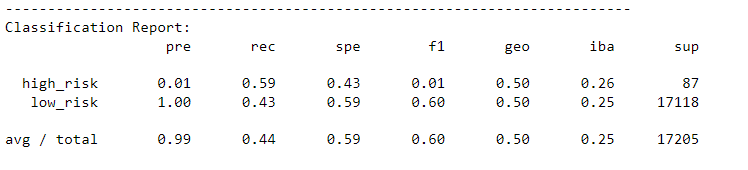
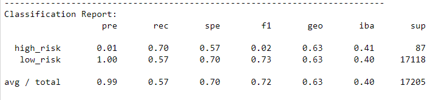
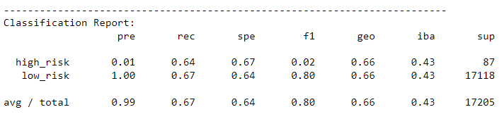
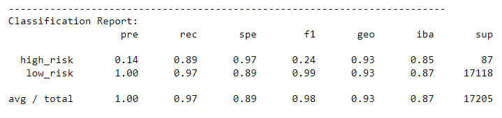

# Module 17 Challenge

## Purpose
Our task was to use loan status data given to train and evaluate multiple models to determine how good they are at assessing credit risk.

### Naive Random Oversampling
Our first model gave an accuracy score for the model of 0.63218 with classification report as follows:

### SMOTE Oversampling
The second model gave an accuracy score of 0.63487 with a classification report of:

### Undersampling
The third model gave an accuracy score of 0.510389 with a classification report of:

### Combination (Over and Under) Sampling
The fourth model gave an accuracy score of 0.637349 with a classification report of:

### Balanced Random Forest Classifier
The fifth model gave an accuracy score of 0.655639 with a classification report of:

### Easy Ensemble AdaBoost Classifier

Finally, the sixth model gave an accuracy score of 0.928538 with a classification report of:

### Conclusion
The first five models are all fairly grouped in terms of their performance, principally their accuracy score.  From results, the recommendation would be modle #6, the Easy Ensemble AdaBoost Classifier.
